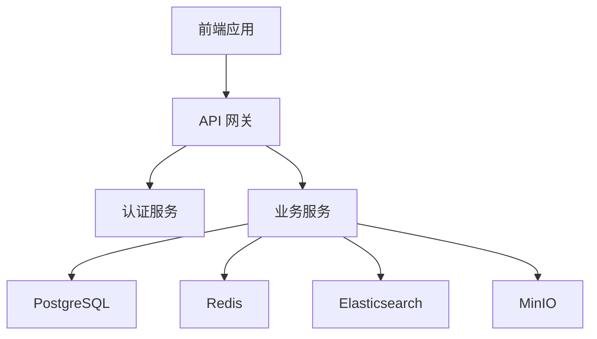
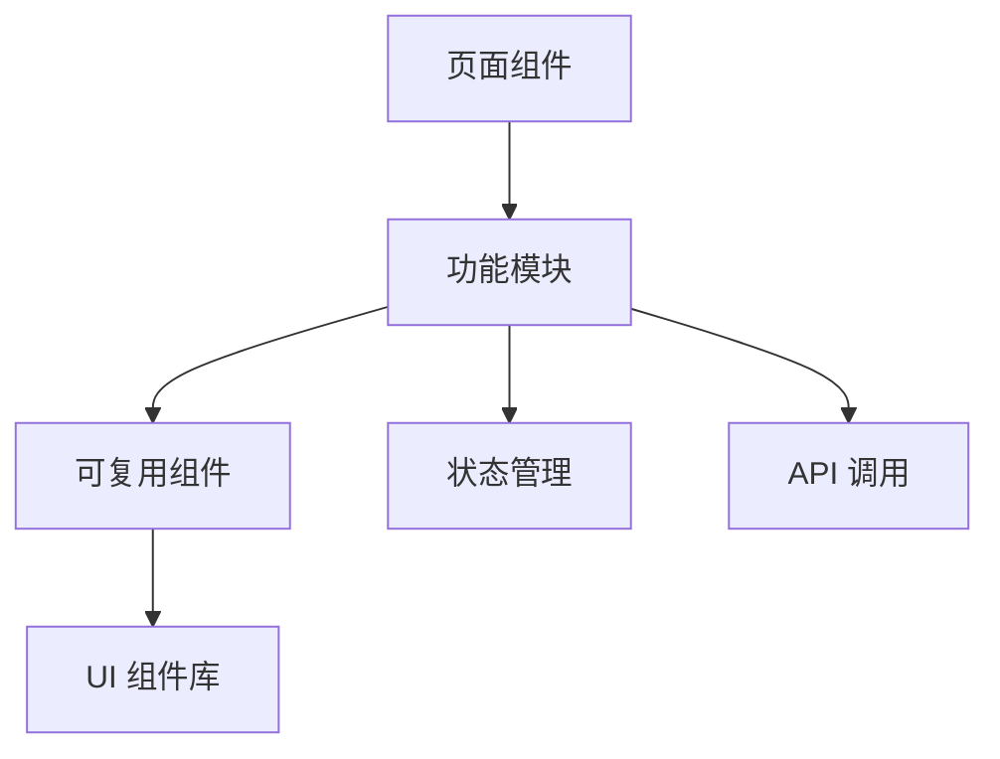
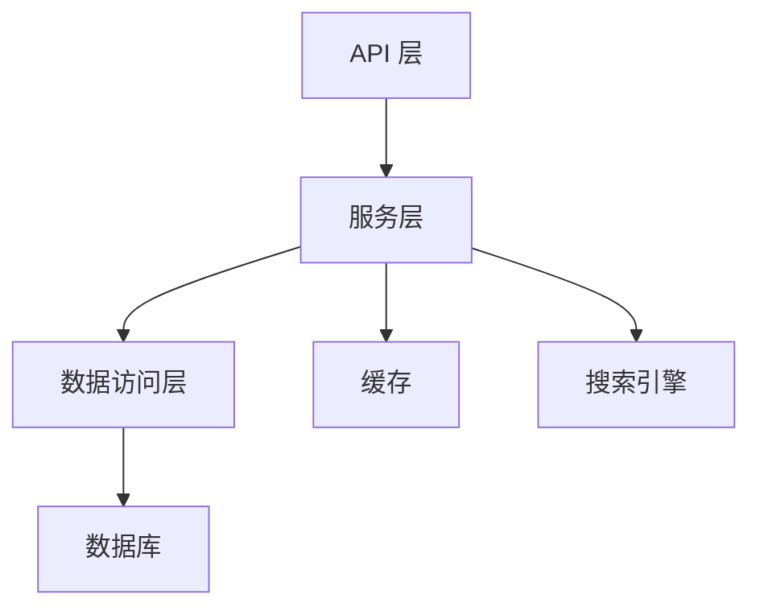

# 提示词管理器技术架构说明

## 1. 技术栈概览

### 1.1 前端技术栈

- **核心框架**：React 18 + TypeScript
- **构建工具**：Vite
- **状态管理**: redux-toolkit
- **路由管理**：React Router v6
- **UI 框架**：Ant Design + Tailwind CSS
- **数据获取**：React Query
- **表单处理**：React Hook Form
- **编辑器**：Monaco Editor / CodeMirror
- **数据可视化**：ECharts

### 1.2 后端技术栈

- **核心框架**：Nest.js + TypeScript
- **数据库**：PostgreSQL + Redis
- **搜索引擎**：Elasticsearch
- **文件存储**：MinIO
- **认证**：JWT
- **API 文档**：Swagger/OpenAPI

### 1.3 开发工具

- **代码规范**：ESLint + Prettier
- **Git Hooks**：Husky
- **测试框架**：Jest + Cypress
- **包管理**：pnpm
- **Monorepo 工具**：Turborepo

## 2. 系统架构

### 2.1 整体架构



### 2.2 前端架构



### 2.3 后端架构



## 3. 项目结构

```
prompt-manager/
├── apps/
│   ├── web/                 # React 前端
│   │   ├── src/
│   │   │   ├── components/  # 可复用组件
│   │   │   ├── features/    # 功能模块
│   │   │   ├── hooks/       # 自定义 hooks
│   │   │   ├── pages/       # 页面组件
│   │   │   └── utils/       # 工具函数
│   │   └── package.json
│   │
│   └── server/             # Nest.js 后端
│       ├── src/
│       │   ├── modules/     # 功能模块
│       │   ├── common/      # 公共代码
│       │   ├── config/      # 配置文件
│       │   └── main.ts
│       └── package.json
│
├── packages/               # 共享包
│   ├── types/             # 类型定义
│   ├── ui/                # UI 组件库
│   └── utils/             # 工具函数
│
└── package.json
```

## 4. 数据库设计

### 4.1 核心表结构

```sql
-- 提示词表
CREATE TABLE prompts (
    id UUID PRIMARY KEY,
    title VARCHAR(255) NOT NULL,
    content TEXT NOT NULL,
    category VARCHAR(50),
    status VARCHAR(20),
    variables JSONB,
    created_at TIMESTAMP,
    updated_at TIMESTAMP,
    user_id UUID
);

-- 标签表
CREATE TABLE tags (
    id UUID PRIMARY KEY,
    name VARCHAR(50) NOT NULL,
    description TEXT,
    created_at TIMESTAMP
);

-- 模板表
CREATE TABLE templates (
    id UUID PRIMARY KEY,
    name VARCHAR(255) NOT NULL,
    content TEXT NOT NULL,
    variables JSONB,
    created_at TIMESTAMP,
    updated_at TIMESTAMP,
    user_id UUID
);
```

## 5. API 设计

### 5.1 RESTful API 规范

- 使用 HTTP 方法表示操作类型
- 使用 URL 表示资源
- 使用 HTTP 状态码表示操作结果
- 使用 JSON 格式传输数据

### 5.2 主要 API 端点

```
GET    /api/v1/prompts          # 获取提示词列表
POST   /api/v1/prompts          # 创建提示词
GET    /api/v1/prompts/:id      # 获取提示词详情
PUT    /api/v1/prompts/:id      # 更新提示词
DELETE /api/v1/prompts/:id      # 删除提示词

GET    /api/v1/templates        # 获取模板列表
POST   /api/v1/templates        # 创建模板
GET    /api/v1/templates/:id    # 获取模板详情
PUT    /api/v1/templates/:id    # 更新模板
DELETE /api/v1/templates/:id    # 删除模板
```

## 6. 安全设计

### 6.1 认证与授权

- JWT 基于 token 的认证
- 基于角色的访问控制（RBAC）
- API 访问限流
- CORS 配置

### 6.2 数据安全

- 密码加密存储
- 敏感数据加密
- SQL 注入防护
- XSS 防护

## 7. 性能优化

### 7.1 前端优化

- 代码分割
- 懒加载
- 缓存策略
- 虚拟滚动

### 7.2 后端优化

- 数据库索引
- 查询优化
- 缓存策略
- 并发控制

## 8. 部署方案

### 8.1 开发环境

- Docker Compose 本地开发
- 热重载
- 开发工具配置

### 8.2 生产环境

- Docker 容器化
- Nginx 反向代理
- CI/CD 流程
- 监控告警

## 9. 开发规范

### 9.1 代码规范

- TypeScript 严格模式
- ESLint 规则
- Prettier 格式化
- Git 提交规范

### 9.2 文档规范

- 代码注释
- API 文档
- 组件文档
- 部署文档
