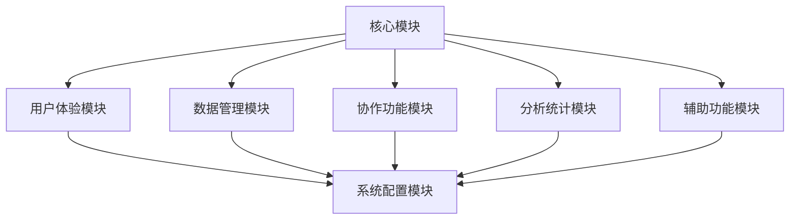

# 提示词管理器功能说明文档

## 1. 核心模块

### 1.1 提示词管理模块

- 创建、编辑、删除提示词
- 复制提示词到剪贴板
- 版本历史记录
- 提示词分类管理
- 提示词状态管理（草稿、已发布、已归档）

### 1.2 标签系统模块

- 标签的 CRUD 操作
- 标签关联管理
- 标签层级结构
- 标签使用统计
- 智能标签推荐

### 1.3 搜索模块

- 全文搜索
- 标签过滤
- 分类过滤
- 高级搜索
- 搜索历史
- 搜索结果排序

### 1.4 模板系统模块

- 模板创建和管理
- 变量占位符定义
- 模板预览
- 变量验证
- 默认值设置
- 模板文档生成

## 2. 用户体验模块

### 2.1 编辑器模块

- 实时预览
- 语法高亮
- Markdown 支持
- 快捷键支持
- 自动保存

### 2.2 界面交互模块

- 拖拽排序
- 批量操作
- 响应式设计
- 主题切换
- 多语言支持

## 3. 数据管理模块

### 3.1 存储模块

- 本地存储
- 云存储
- 数据加密
- 备份恢复
- 数据同步

### 3.2 导入导出模块

- JSON 导入导出
- CSV 导入导出
- 批量导入
- 数据验证
- 错误处理

## 4. 协作功能模块

### 4.1 分享模块

- 提示词分享
- 权限控制
- 分享链接生成
- 访问统计

### 4.2 社区模块

- 公共模板市场
- 评分系统
- 评论功能
- 收藏功能
- 协作编辑

## 5. 分析统计模块

### 5.1 数据统计模块

- 使用频率统计
- 效果评估
- 使用历史记录
- 数据可视化
- 报表生成

### 5.2 智能分析模块

- 相似度分析
- 使用模式分析
- 优化建议
- 趋势分析

## 6. 系统配置模块

### 6.1 设置模块

- 用户偏好设置
- 系统配置
- 快捷键配置
- 通知设置
- API 配置

### 6.2 安全模块

- 用户认证
- 权限管理
- 数据加密
- 操作日志
- 安全审计

## 7. 辅助功能模块

### 7.1 帮助模块

- 使用教程
- 最佳实践
- 常见问题
- 在线帮助
- 用户反馈

### 7.2 性能优化模块

- 离线支持
- 缓存管理
- 性能监控
- 资源优化
- 加载优化

## 模块依赖关系

## 开发优先级

1. 第一阶段（MVP）：

   - 提示词管理模块
   - 标签系统模块
   - 基础搜索模块
   - 基础模板系统
   - 基础编辑器

2. 第二阶段：

   - 数据管理模块
   - 用户体验优化
   - 基础分析功能
   - 系统配置

3. 第三阶段：

   - 协作功能
   - 高级分析
   - 社区功能
   - 性能优化

4. 第四阶段：
   - 智能功能
   - 高级模板
   - 完整辅助功能
   - 系统完善
